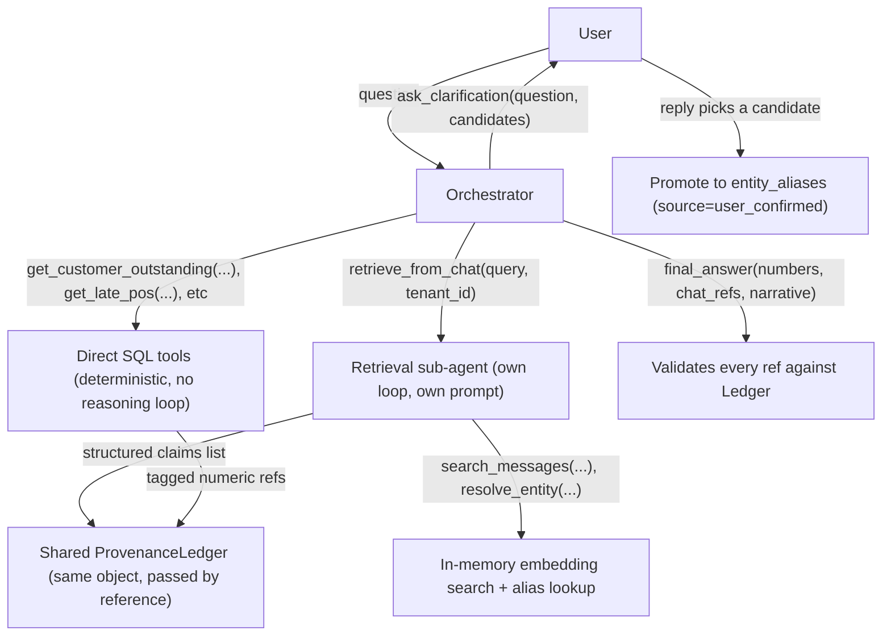

# Two Worlds Prototype — Plan

A system that reasons across two sources of truth for a business: a structured ERP (Postgres) and unstructured WhatsApp-style chat — answering questions that need both, while guaranteeing that every financial figure in an answer is traceable to a real database row, never invented by the model.

## Phasing

This plan is split into two build phases:

- **Phase 1 — Core agent infra (done)**: a running FastAPI service with one agent loop, in-memory session state that persists across turns of a conversation, txt-file prompts, and a minimal tool (`final_answer`, no domain logic yet) — proving the orchestration mechanics work end to end: ask something, get an answer, ask a follow-up in the same session and see it remember context. No Postgres, no seed data, no retrieval sub-agent, no entity linking, no provenance validation yet.
- **Phase 2 — The Two Worlds problem (next)**: everything domain-specific — Postgres schema + seed data, SQL tools, the retrieval sub-agent, entity linking + clarification loop, the provenance ledger and hard-line `final_answer` validation, contradiction detection, eval harness, design note.

## Status

- [x] Phase 1 — core agent infra, verified working (session continuity + isolation confirmed manually)
- [ ] Phase 2 — domain-specific tools and correctness guarantees

## 0. The hierarchy: orchestrator + retrieval sub-agent

Two agent loops, not one:



- **Orchestrator agent** (`app/agent/orchestrator.py`): the top-level loop. Its tools are the handful of parametrized SQL tools (direct, single-shot, deterministic — never a reasoning loop), `retrieve_from_chat` (a tool that, under the hood, runs an entire sub-agent loop), and **two** response tools: `final_answer` and `ask_clarification`.
- **Retrieval sub-agent** (`app/agent/retrieval_agent.py`): given a query + tenant_id, runs its own small loop (own system prompt in `prompts/retrieval_agent.txt`) with tools `search_messages` and `resolve_entity`. It can reformulate/re-search, but it must terminate by calling its own `return_claims` tool with a **structured list**: `[{message_ref, sender, timestamp, extracted_claim, linked_entity}]` — never a prose summary.
- **Shared provenance ledger**: the orchestrator creates one `ProvenanceLedger` per session and passes the *same instance* into the retrieval sub-agent's ephemeral state. When `return_claims` runs, each claim is registered into that shared ledger with a `chat:<n>` ref before being handed back to the orchestrator as a tool result. This means the orchestrator's `final_answer` validation (section 6) works uniformly whether a ref came from `sql:` or `chat:` — same ledger, same validation code path — and the orchestrator retains the ability to cross-check chat claims against SQL rows for contradiction detection (section 8), because it receives the structured claim, not opaque text.
- The retrieval sub-agent's own conversation (its internal tool calls, reformulations) is **not** persisted anywhere either — it's an ephemeral `list[dict]` local to that one tool invocation, discarded once `return_claims` returns.
- **Clarification as a second response tool**: `ask_clarification(question, candidates)` is marked `is_response_tool=True` in `ORCHESTRATOR_TOOLS`, same as `final_answer` — either one legitimately ends the loop (`should_terminate_after_tools` checks the flag, not the specific tool name). The user's reply is just the next human turn in the same `SessionState`; no special session-resume logic needed since the conversation history is already sitting in memory.

## 1. Project layout

```
AI-Prototype/
  README.md
  requirements.txt                # [phase 1] fastapi, uvicorn, openai, python-dotenv, pydantic
                                   # [phase 2 adds] psycopg[binary], numpy
  .env                             # [phase 1] OPENAI_API_KEY   [phase 2 adds] DATABASE_URL  (gitignored)
  run.sh                           # sets up venv + starts the server
  db/                              # [phase 2]
    schema.sql                    # orders, purchase_orders, invoices, payments, inventory, suppliers, customers (+ tenant_id everywhere)
    seed_tenant_a.py                # generates + inserts a few hundred rows, tenant A
    seed_tenant_b.py                # generates + inserts a few hundred rows, tenant B (deliberately interacting/contradicting)
    entity_aliases.sql             # entity_alias table: tenant_id, alias_text, canonical_type, canonical_id, confidence, source
  chat_data/                       # [phase 2]
    tenant_a_messages.json          # few hundred WhatsApp-style messages, informal phrasing
    tenant_b_messages.json
    seed_messages.py                # loader + embedding precompute
  app/
    main.py                        # [done] FastAPI app, /chat + /health endpoints, static chat UI
    config.py                      # [done] env loading
    db.py                          # [phase 2] psycopg connection pool, read-only query helper
    static/
      index.html                    # [done] minimal chat UI: per-session id, "New chat" button
    prompts/
      orchestrator.txt               # [done: minimal loop instructions] [phase 2: + query planning, hard-line rule, contradiction policy]
      retrieval_agent.txt            # [phase 2] retrieval sub-agent instructions (reformulation, when to stop, structured output requirement)
    state/                          # [done]
      session_state.py              # SessionState class (in-memory only) — orchestrator-level
      store.py                      # module-level dict[session_id, SessionState], no persistence
    agent/                          # [done]
      fsm.py                         # shared invoke_llm/invoke_tools/workflow loop, used by both agents
      orchestrator.py                # constructs the persistent SessionState + ORCHESTRATOR_TOOLS, calls fsm.run_workflow(...)
      retrieval_agent.py              # [phase 2] constructs an ephemeral SessionState + RETRIEVAL_TOOLS per invocation, calls fsm.run_workflow(...)
      openai_client.py               # [done] thin wrapper around OpenAI client, tool-calling
    tools/
      base.py                        # [done] Tool dataclass, registry, OpenAI schema conversion
      final_answer_tool.py             # [done: bare pass-through] [phase 2: + validates every $ figure and chat claim against the provenance ledger]
      sql_tools.py                   # [phase 2] get_customer_outstanding, get_supplier_pos, get_late_orders (parametrized, tenant-scoped, deterministic, no LLM involved in query construction)
      search_tools.py                 # [phase 2] search_messages(query, tenant_id, top_k) — in-memory cosine sim over precomputed embeddings; used only by the retrieval sub-agent
      entity_link_tools.py            # [phase 2] resolve_entity(mention, tenant_id) — deterministic alias table lookup first, LLM-assisted fuzzy fallback with confidence threshold, never silently auto-creates high-stakes links
      retrieval_tool.py                # [phase 2] retrieve_from_chat(query, tenant_id) — orchestrator-facing tool that runs the retrieval sub-agent loop and registers returned claims into the shared ledger
    provenance/                      # [phase 2]
      tracker.py                     # ProvenanceLedger: records {claim_span, source_type, source_id, raw_value} for every tool result surfaced in a turn; final_answer tool cross-checks numeric tokens against this ledger
    eval/                            # [phase 2]
      cases.json                     # ~15-20 question/expected-shape test cases (numeric ones have exact expected values from DB; narrative ones check required source citations are present)
      run_eval.py                    # script: runs each case through the agent, asserts numeric answers match DB ground truth exactly, asserts cited message ids exist
  DESIGN_NOTE.md                    # [phase 2] the 2-page write-up: entity linking, trust/contradiction model, hard-line enforcement mechanism, provenance model, what's unsolved
```

## 2. Data model (Postgres, two tenants) — Phase 2

`db/schema.sql` — every table has `tenant_id`:

- `suppliers(id, tenant_id, code, name)`, `customers(id, tenant_id, code, name)`
- `purchase_orders(id, tenant_id, code, supplier_id, status, quantity, received_quantity, due_date, created_at)`
- `orders(id, tenant_id, code, customer_id, status, promised_date, created_at)`
- `invoices(id, tenant_id, code, customer_id, amount, created_at)`
- `payments(id, tenant_id, invoice_id, amount, paid_at)`
- `inventory(id, tenant_id, sku, description, quantity)`
- `entity_aliases(id, tenant_id, alias_text, canonical_type, canonical_id, confidence, source)` — the entity-linking bridge table, deterministic and inspectable (source = `seed`|`reviewed`|`llm_suggested`|`user_confirmed`; the last one is written at runtime when a user resolves an `ask_clarification` question, see section 7)
- `unresolved_mentions(id, tenant_id, raw_text, first_seen, message_ref, times_seen)` — mentions that never cleared the resolution threshold and weren't material enough to block an answer; a queue for later curation into `entity_aliases`

Seed scripts deliberately create interacting/contradicting cases:
- A purchase order the ERP says is open/full-quantity/due Tuesday, while a seeded chat message from the prior Friday says it was partially received, short by some quantity — the flat contradiction case.
- A customer with an ERP invoice outstanding amount, while a chat message says part of it is disputed — the number-with-qualifier case.
- A supplier that exists in ERP with open POs but has zero chat mentions in two months — the absence-of-evidence case.
- Vocabulary drift seeded explicitly across tenant A vs B (e.g. tenant A says "lot", tenant B says "batch" for the same concept) via different alias entries per tenant in `entity_aliases`.

## 3. Stateful session object (in-memory only) — done

`app/state/session_state.py`: `chat_messages` is the single source of truth for a conversation; the flat LLM-ready message list is *derived* from it on demand via `get_base_messages()`. Three mutators (`add_human_message` / `add_ai_message` / `add_tool_output`) map 1:1 onto the OpenAI chat-completions message roles (`user` / `assistant` / `tool`).

`app/state/store.py` — a plain module-level `dict[str, SessionState]`, no TTL eviction, no persistence fallback. No DB table, no file write; restarting the server drops all sessions by design.

## 4. Prompts as txt files

`app/prompts/orchestrator.txt` — loaded once at import time.

- **Done**: enough to make the loop demonstrably work — instructions to hold a conversation, use `final_answer` to respond, and remember earlier context in the same session.
- **Phase 2 adds**: the query-planning instructions (when to use SQL tools vs. `retrieve_from_chat` vs. both) and, critically, explicit framing of the hard line: *"You must never type a rupee/quantity figure that did not come verbatim from a tool result. If you need a number, call a SQL tool."* (Prompting reinforces the rule for reasoning quality, but section 6 is what actually *enforces* it.)

## 5. The two agent loops

`app/agent/fsm.py` — an execution loop built from four small functions:

| Function | Responsibility | Termination condition it contributes |
|---|---|---|
| `invoke_llm(state, tool_registry)` | Calls the model with tools bound, appends the assistant turn via `state.add_ai_message(...)` | — |
| `has_tool_call(last_message)` | `bool(last_message.get("tool_calls"))` | Loop only continues into `invoke_tools` if true |
| `invoke_tools(state, tool_registry)` | Iterates `tool_calls`, resolves each tool's args, validates, runs it, appends a tool-result message per call via `state.add_tool_output(...)` | — |
| `should_terminate_after_tools(last_tool_message, tool_registry)` | True only if the last tool result came from a tool marked `is_response_tool=True` (`final_answer` for the orchestrator, `return_claims` for the retrieval sub-agent) and it succeeded | This is what actually ends the loop — never the model "deciding" to stop |
| `run_workflow(state, tool_registry)` | `invoke_llm` once, then loop: `invoke_tools` → break if terminate → raise if LLM-call budget exceeded → `invoke_llm` again | Enforces `FSM_MAX_LLM_CALLS` as a hard safety net |

**Orchestrator** (`app/agent/orchestrator.py`) uses `run_workflow()` with a long-lived `SessionState` (persists only for the process lifetime) and `ORCHESTRATOR_TOOLS` (currently just `final_answer`; phase 2 adds SQL tools + `retrieve_from_chat` + `ask_clarification`).

**Retrieval sub-agent** (phase 2, `app/agent/retrieval_agent.py`) will call the *same* `run_workflow()` function with a throwaway `SessionState` constructed fresh per invocation and `RETRIEVAL_TOOLS` (`search_messages`, `resolve_entity`, `return_claims` as the response tool) — the "child agent invoked as a tool, own state, own loop" pattern applied to retrieval specifically. The `retrieve_from_chat` tool's `run()` will: construct the child `SessionState`, call `run_workflow(child_state, RETRIEVAL_TOOLS)`, extract the claims from the `return_claims` call, register each into the **orchestrator's** `ProvenanceLedger` (passed down explicitly, not through the child state), and return the resulting claims as this tool call's string result.

## 6. Enforcing "numbers only from SQL" structurally — Phase 2

This is the core mechanism the problem demands be shown, not asserted:

1. Every SQL tool's `run()` wraps returned numeric values in tagged tokens recorded in `ProvenanceLedger` with a unique ref id, e.g. `{"ref": "sql:7", "value": 420000, "source": "invoices row 55"}`, and returns to the model a string like `"outstanding=420000 [ref:sql:7]"`.
2. The `final_answer` tool's schema requires the model to pass **structured fields** for any numeric claim — `numbers: list[{value, ref}]` — separate from free-text `narrative`. It is not allowed to embed raw numbers only inside prose.
3. `final_answer.run()` validates: every entry in `numbers` must have a `ref` that exists in `state.provenance` and whose stored value matches exactly (`value == ledger[ref].value`). If the model fabricates a number or a ref, validation fails, the tool returns an error string (not a success), and the loop continues — the model must retry, it can never successfully terminate with an unverified figure.
4. Regex safety net: after validation passes, scan `narrative` for numeric patterns not equal to any verified number/ref pair as a defense-in-depth check (logged as a warning if triggered, since narrative may legitimately reference non-financial numbers like dates).

This makes the guarantee architectural (the answer literally cannot be returned) rather than a prompt instruction the model might ignore.

## 7. Entity linking — Phase 2

- Step 1 (deterministic): exact/fuzzy lookup against `entity_aliases` for the tenant — many-to-one (multiple alias strings per canonical id). This is the seeded, curated bridge and is trusted fully; a hit here never involves the LLM at all.
- Step 2 (LLM-assisted, only for unseen aliases): the model may call `suggest_entity_link(mention, candidates)` which returns a **candidate list with confidence scores**, never a single silent answer.
- Step 3 (deterministic threshold check on top of step 2's scores): a hardcoded numeric cutoff plus a fixed margin check between the top two candidates classifies the result as **resolved** (single candidate above threshold, clear margin), **ambiguous** (multiple candidates near the threshold), or **unresolved** (nothing clears it). This classification itself is deterministic code, not an LLM judgment call.
- Step 4 (LLM judgment, only reached for ambiguous/unresolved): the orchestrator's prompt instructs it to decide whether the ambiguity is *material* — does answering correctly depend on this specific entity being right (especially anything feeding a financial number)? If yes, it calls `ask_clarification(question, candidates)`, a second response tool that ends the loop and returns the candidate list to the user instead of an answer. If incidental, the LLM proceeds and simply caveats it in the narrative.
- **Promotion loop**: when the user's reply to a clarification picks a candidate, that resolution is written back into `entity_aliases` with `source: "user_confirmed"`. Next time that phrase appears (same tenant), step 1's deterministic lookup resolves it directly.
- **Unresolved, non-blocking case**: if nothing clears the threshold and the LLM decides not to interrupt the user, the claim/mention is recorded with `linked_entity: null`, and the raw mention logged to `unresolved_mentions` for later curation.
- Because SQL tools require a resolved canonical id (not free text), a bad/ambiguous link can never silently flow into a financial query — it either resolves deterministically, gets asked about, or stays explicitly unlinked.
- `resolve_entity` is available to **both** agents.

## 8. Contradiction + provenance + number-with-qualifier — Phase 2

- **Contradiction detection**: when a search tool and a SQL tool both surface data about the same linked entity within one turn, a checker compares structured chat-extracted claims against the SQL row's fields and flags a mismatch. The prompt instructs the model that on a flagged mismatch it must present both sources with timestamps and label the ERP as authoritative-but-possibly-stale and chat as current-but-unverified — never silently pick one.
- **Provenance**: `ProvenanceLedger` (per-session, in-memory) is the single data model for "where did that come from" — every ledger entry has `{ref, source_type: sql|chat, source_id, raw_value_or_text, table_or_message_ts, sender}`. The `final_answer` schema requires narrative claims about disputes/context to also cite `chat_refs: list[ref]`, validated the same way as numeric refs.
- **Number with a qualifier**: when a chat-sourced dispute amount overlaps a SQL-sourced outstanding amount, `final_answer` supports returning a structured qualifier: `{amount: {value, ref}, qualifier: {disputed_amount: {value, ref}, note}}` rather than one flattened number — the disputed figure's `ref` must point to a `chat` provenance entry, and the narrative may only state it as disputed, never as fact.

The remaining three items (absence of evidence, tenant vocabulary, evaluation) get a written design section in `DESIGN_NOTE.md` plus the minimal plumbing described above, but not full agent-side reasoning logic.

## 9. Minimal eval harness — Phase 2

`cases.json`: ~15-20 cases, each either numeric (script re-runs the DB query independently and asserts an exact match) or narrative (asserts the answer cites at least one real message id). `run_eval.py` drives the agent loop directly (no HTTP) and prints pass/fail per case.

## 10. Retrieval (in-memory embeddings) — Phase 2

`chat_data/seed_messages.py` calls the OpenAI embeddings API once per message at seed time, stores `(message_id, tenant_id, vector)` in a local file alongside the raw messages JSON. `app/tools/search_tools.py` loads this file at process startup into memory and does numpy cosine similarity for `search_messages(query, tenant_id, top_k)` — no pgvector, no external vector DB.

## 11. Setup instructions

**Phase 1 (done)**:

1. Fill `OPENAI_API_KEY` in `.env`
2. `./run.sh` (creates venv, installs deps, starts the server on port 8000)
3. Open `http://127.0.0.1:8000/` for the chat UI, or use `curl`/Postman against `POST /chat`

**Phase 2 (next)**. Will use a local Postgres database with all tables inside a dedicated `two_worlds` schema (namespace):

4. `psql <database> -f db/schema.sql`
5. Add `DATABASE_URL=...` to `.env`
6. `python db/seed_tenant_a.py && python db/seed_tenant_b.py`
7. `python chat_data/seed_messages.py` (generates messages + embeddings)
8. `python app/eval/run_eval.py` for regression checks
