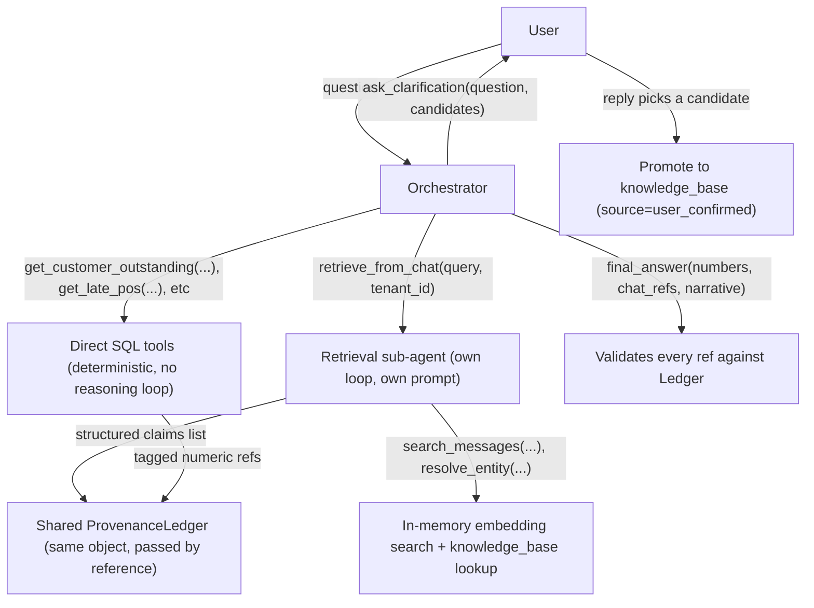
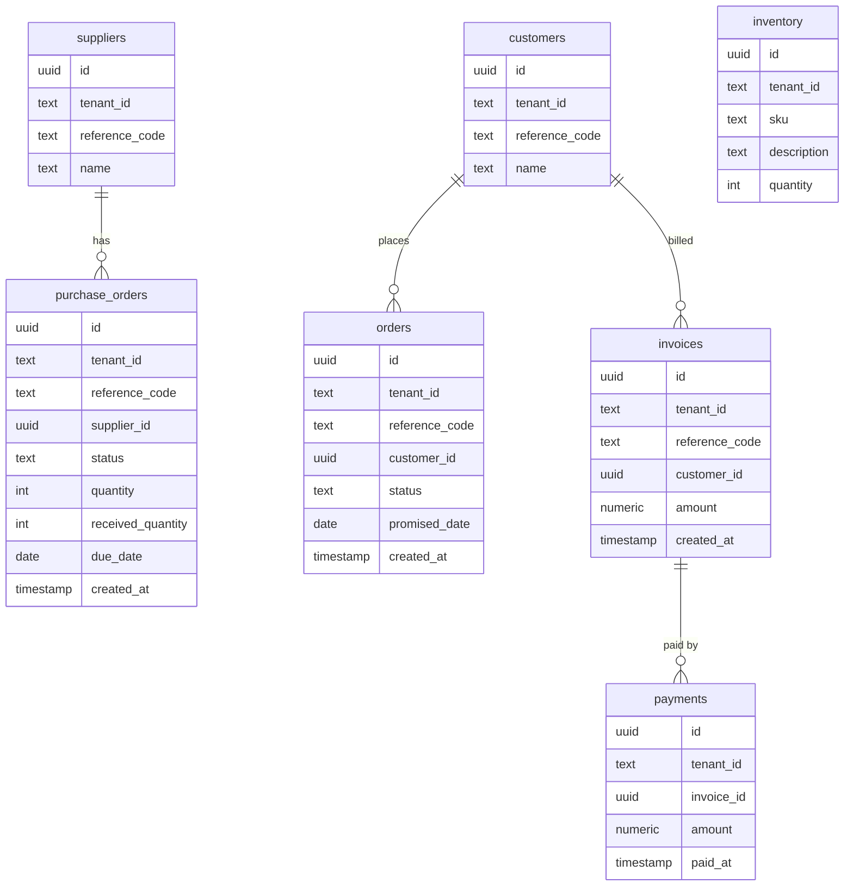
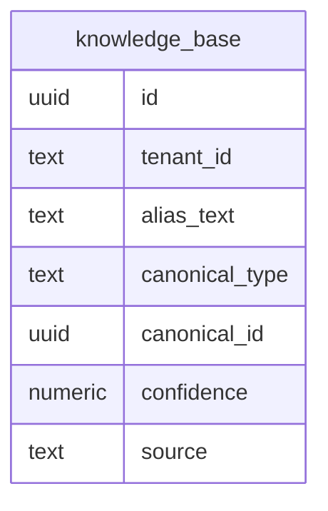
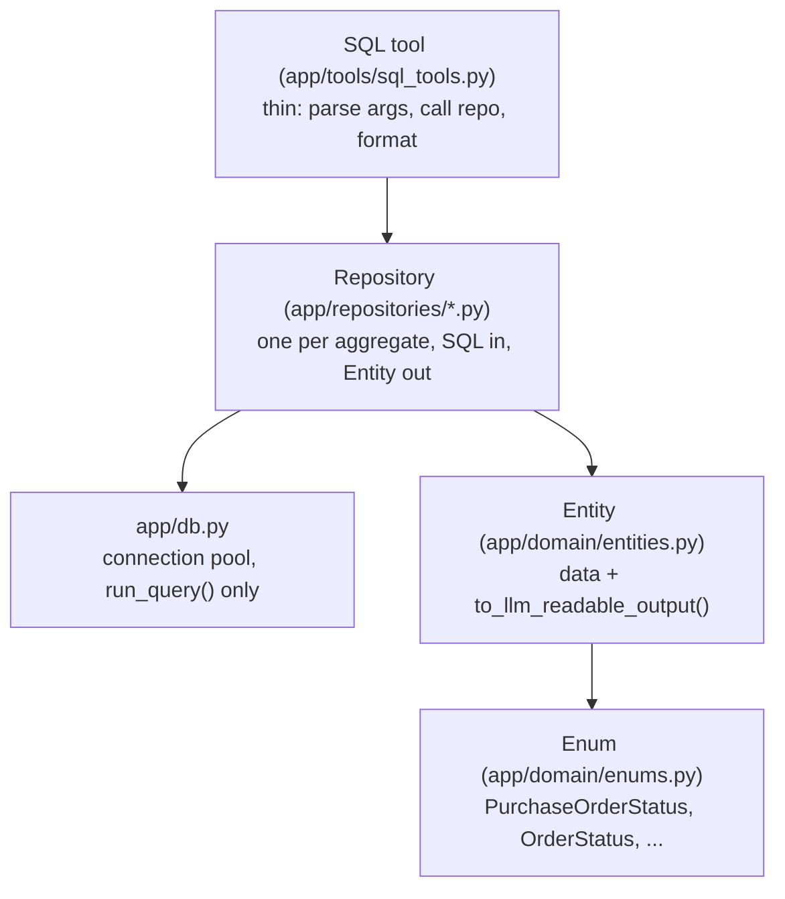

# Two Worlds Prototype — Plan

A system that reasons across two sources of truth for a business: a structured ERP (Postgres) and unstructured WhatsApp-style chat — answering questions that need both, while guaranteeing that every financial figure in an answer is traceable to a real database row, never invented by the model.

## Phasing

This plan is split into four build phases, aligned to the three levels of difficulty in the problem explainer (`two_worlds_explainer.pdf`):

- **Phase 1 — Core agent infra (done)**: a running FastAPI service with one agent loop, in-memory session state that persists across turns of a conversation, txt-file prompts, and a minimal tool (`final_answer`, no domain logic yet) — proving the orchestration mechanics work end to end: ask something, get an answer, ask a follow-up in the same session and see it remember context. No Postgres, no seed data, no retrieval sub-agent, no entity linking, no provenance validation yet.
- **Phase 2 — Two Worlds, Separately (Level 1)**: the SQL side and the chat-search side each work correctly on their own, with zero fusion logic. A properly normalized ERP schema with a SOLID domain layer (enums, entities, repositories), SQL tools, and in-memory embedding search — added straight to the orchestrator as two independent tool sets.
- **Phase 3 — Make Them Talk (Level 2)**: the orchestrator can plan across both sources, link informal chat mentions to canonical ERP ids without ever silently corrupting a figure, and is architecturally prevented from stating a fabricated number. This is where the hierarchy in section 0 gets built: the retrieval sub-agent, the shared provenance ledger, and the hard-line `final_answer` validation.
- **Phase 4 — The Genuinely Hard Stuff (Level 3)**: contradiction detection, numbers with qualifiers, absence-of-evidence handling, tenant vocabulary drift, full end-to-end provenance, the eval harness, and the design note write-up.

**Note on execution**: Phase 2 and Phase 3 are documented as two separate sections below — that separation is the clearest way to show *what belongs to which level of difficulty* — but they are **built together as one combined implementation pass** (no demo/pause at the Level-1-only boundary). Phase 4 is a separate, later pass once that combined pass is working end to end.

## Status

- [x] Phase 1 — core agent infra, verified working (session continuity + isolation confirmed manually)
- [x] Phase 2 — SQL + chat search, independently correct (Level 1)
- [x] Phase 3 — cross-source planning, entity linking, hard-line enforcement (Level 2)
- [ ] Phase 4 — contradiction, qualifiers, absence of evidence, vocabulary drift, eval, design note (Level 3)

## 0. The hierarchy: orchestrator + retrieval sub-agent — Phase 3

Two agent loops, not one:



- **Orchestrator agent** (`app/agent/orchestrator.py`): the top-level loop. Its tools are the handful of parametrized SQL tools (direct, single-shot, deterministic — never a reasoning loop), `retrieve_from_chat` (a tool that, under the hood, runs an entire sub-agent loop), and **two** response tools: `final_answer` and `ask_clarification`.
- **Retrieval sub-agent** (`app/agent/retrieval_agent.py`): given a query + tenant_id, runs its own small loop (own system prompt in `prompts/retrieval_agent.txt`) with tools `search_messages` and `resolve_entity`. It can reformulate/re-search, but it must terminate by calling its own `return_claims` tool with a **structured list**: `[{message_ref, sender, timestamp, extracted_claim, linked_entity}]` — never a prose summary.
- **Shared provenance ledger**: the orchestrator creates one `ProvenanceLedger` per session and passes the *same instance* into the retrieval sub-agent's ephemeral state. When `return_claims` runs, each claim is registered into that shared ledger with a `chat:<n>` ref before being handed back to the orchestrator as a tool result. This means the orchestrator's `final_answer` validation (section 6) works uniformly whether a ref came from `sql:` or `chat:` — same ledger, same validation code path — and the orchestrator retains the ability to cross-check chat claims against SQL rows for contradiction detection (section 8), because it receives the structured claim, not opaque text.
- The retrieval sub-agent's own conversation (its internal tool calls, reformulations) is **not** persisted anywhere either — it's an ephemeral `list[dict]` local to that one tool invocation, discarded once `return_claims` returns.
- **Clarification as a second response tool**: `ask_clarification(question, candidates)` is marked `is_response_tool=True` in `ORCHESTRATOR_TOOLS`, same as `final_answer` — either one legitimately ends the loop (`should_terminate_after_tools` checks the flag, not the specific tool name). The user's reply is just the next human turn in the same `SessionState`; no special session-resume logic needed since the conversation history is already sitting in memory.

## 1. Project layout

```
AI-Prototype/
  README.md
  requirements.txt                # [phase 1] fastapi, uvicorn, openai, python-dotenv, pydantic
                                   # [phase 2 adds] psycopg[binary], numpy
  .env                             # [phase 1] OPENAI_API_KEY   [phase 2 adds] DATABASE_URL  (gitignored)
  run.sh                           # sets up venv + starts the server
  db/                              # [phase 2]
    schema.sql                    # orders, purchase_orders, invoices, payments, inventory, suppliers, customers (+ tenant_id everywhere, UUID ids, reference_code human-facing ids)
    knowledge_base.sql            # knowledge_base table: tenant_id, alias_text, canonical_type, canonical_id, confidence, source (empty until Phase 3 writes/reads it)
    seed_tenant_a.py                # generates + inserts a few hundred rows, tenant A, plus a handful of reviewed knowledge_base rows
    seed_tenant_b.py                # generates + inserts a few hundred rows, tenant B (deliberately interacting/contradicting), plus its own reviewed knowledge_base rows
  chat_data/                       # [phase 2]
    tenant_a_messages.json          # few hundred WhatsApp-style messages, informal phrasing
    tenant_b_messages.json
    seed_messages.py                # loader + embedding precompute
  app/
    main.py                        # [done] FastAPI app, /chat + /health endpoints, static chat UI
    config.py                      # [done] env loading
    db.py                          # [phase 2] psycopg connection pool, exposes only run_query(sql, params) -> list[dict]
    domain/                        # [phase 2]
      enums.py                     # PurchaseOrderStatus, OrderStatus, CanonicalEntityType, KnowledgeSource [phase 2]; extended in [phase 4] with contradiction-report enums
      entities.py                  # LLMReadableEntity base + Supplier/Customer/PurchaseOrder/Order/Invoice/Payment/InventoryItem [phase 2]; + KnowledgeBaseEntry/ChatClaim [phase 3]; + ContradictionReport [phase 4]
    repositories/                  # [phase 2]
      supplier_repository.py, customer_repository.py, purchase_order_repository.py, order_repository.py, invoice_repository.py, inventory_repository.py   # [phase 2] SQL in, typed entities out
      knowledge_base_repository.py  # [phase 3] queries the knowledge_base table created in phase 2
    static/
      index.html                    # [done] minimal chat UI: per-session id, "New chat" button
    prompts/
      orchestrator.txt               # [done: minimal loop instructions] [phase 2: + new SQL/search tool descriptions] [phase 3: + query planning, hard-line rule]
      retrieval_agent.txt            # [phase 3] retrieval sub-agent instructions (reformulation, when to stop, structured output requirement)
    state/                          # [done]
      session_state.py              # SessionState class (in-memory only) — orchestrator-level
      store.py                      # module-level dict[session_id, SessionState], no persistence
    agent/                          # [done]
      fsm.py                         # shared invoke_llm/invoke_tools/workflow loop, used by both agents
      orchestrator.py                # constructs the persistent SessionState + ORCHESTRATOR_TOOLS, calls fsm.run_workflow(...)
      retrieval_agent.py              # [phase 3] constructs an ephemeral SessionState + RETRIEVAL_TOOLS per invocation, calls fsm.run_workflow(...)
      openai_client.py               # [done] thin wrapper around OpenAI client, tool-calling
    tools/
      base.py                        # [done] Tool dataclass, registry, OpenAI schema conversion
      final_answer_tool.py             # [done: bare pass-through] [phase 3: + validates every $ figure and chat claim against the provenance ledger]
      sql_tools.py                   # [phase 2] get_customer_outstanding, get_supplier_pos, get_late_orders (parametrized, tenant-scoped, deterministic, no LLM involved in query construction); [phase 3] results wrapped with provenance refs
      search_tools.py                 # [phase 2] search_messages(query, tenant_id, top_k) — in-memory cosine sim over precomputed embeddings; used only by the retrieval sub-agent from phase 3 onward
      entity_link_tools.py            # [phase 3] resolve_entity(mention, tenant_id) — deterministic knowledge_base lookup first, LLM-assisted fuzzy fallback with confidence threshold, never silently auto-trusts an LLM-suggested link
      retrieval_tool.py                # [phase 3] retrieve_from_chat(query, tenant_id) — orchestrator-facing tool that runs the retrieval sub-agent loop and registers returned claims into the shared ledger
    provenance/                      # [phase 3]
      tracker.py                     # ProvenanceLedger: records {ref, source_type, source_id, raw_value} for every tool result surfaced in a turn; final_answer tool cross-checks numeric tokens against this ledger
    eval/                            # [phase 4]
      cases.json                     # ~15-20 question/expected-shape test cases (numeric ones have exact expected values from DB; narrative ones check required source citations are present)
      run_eval.py                    # script: runs each case through the agent, asserts numeric answers match DB ground truth exactly, asserts cited message ids exist
  DESIGN_NOTE.md                    # [phase 4] the 2-page write-up: entity linking, trust/contradiction model, hard-line enforcement mechanism, provenance model, what's unsolved
```

## 2. Data model (Postgres, two tenants) — Phase 2

`db/schema.sql` — every table carries `tenant_id`; all primary keys (`id`) and foreign keys pointing at them are `UUID` (via Postgres's built-in `gen_random_uuid()`, no extension needed) — never a sequential integer, so ids never leak row counts and stay stable if rows are ever re-seeded. The human-facing `reference_code` columns (`SUP-1043`, `PO-4812`, `CUST-0078`) remain plain `TEXT` and are what tools, prompts, and the model actually reference — the `UUID` is purely an internal join key, never surfaced to the model.



- `purchase_orders.status`: `open | partially_received | received | cancelled`. A PO is "late" when `status != received` and `due_date < today`.
- `orders.status`: `pending | shipped | delayed | delivered | cancelled`.
- Outstanding for a customer = `sum(invoices.amount) - sum(payments.amount)` across their invoices, scoped to `tenant_id`.
- Both status columns are backed by a Postgres native `CREATE TYPE ... AS ENUM (...)` (not free-text `CHECK`), so the DB itself rejects an invalid status — the Python-side enums in section 2.1 are the single source of truth these Postgres enums are generated from.
- **Commenting convention**: every table and every column in `db/schema.sql` gets a one-line plain-English `-- comment` above it explaining what it means in everyday words, not jargon — someone who has never seen a database should be able to read the file top to bottom and understand the business, not just the syntax.

### 2.1 The entity-linking bridge (`db/knowledge_base.sql`)

Phase 2 also fully defines — as its own file — the one table Phase 3's entity linking depends on. It's created now (empty) so Phase 3 is pure logic, not a migration:



```sql
-- A learned or confirmed mapping from an informal chat name to the exact ERP record it means.
-- e.g. chat says "Supplier B" or "supp B" -- this row says that means SUP-1043.
-- Only rows with source = reviewed or user_confirmed are ever trusted silently;
-- an llm_suggested row is a pending proposal, never used until a person confirms it.
CREATE TABLE knowledge_base (
    id UUID PRIMARY KEY DEFAULT gen_random_uuid(),
    tenant_id TEXT NOT NULL,                       -- which business this mapping belongs to
    alias_text TEXT NOT NULL,                      -- the informal phrase as written in chat, e.g. "supp B"
    canonical_type entity_type NOT NULL,           -- which kind of ERP record this points to
    canonical_id UUID NOT NULL,                    -- the id of that exact ERP record (no single FK possible -- it can point at any table)
    confidence NUMERIC(3,2) NOT NULL DEFAULT 1.0,  -- how sure we are this mapping is correct, 0 to 1
    source knowledge_source NOT NULL                -- how this mapping came to exist (reviewed, model-suggested, user-confirmed)
);
```

No `unresolved_mentions` table — when a mention can't be confidently resolved and isn't material enough to interrupt the user with `ask_clarification`, it's simply caveated in the narrative and forgotten, not persisted anywhere (nothing in this plan ever reads such a log back out, so it would just be dead weight).

`canonical_id` intentionally has no `REFERENCES` constraint — it's a polymorphic pointer (a supplier's id in one row, an invoice's id in another), so which table it points into is validated at the application layer via `canonical_type`, not by Postgres.

This table and its enums are created in Phase 2 but stay empty and unread until Phase 3 — `db/seed_tenant_a.py`/`seed_tenant_b.py` seed a handful of `source="reviewed"` rows per tenant now (this is also where tenant-vocabulary-drift setup lives: tenant A's row maps `"lot"` → the same inventory item tenant B's row maps `"batch"` to), so Phase 3's `resolve_entity` has real data to look up from day one instead of starting from zero.

Seed scripts deliberately create interacting/contradicting cases for Phase 3/4 to reconcile, even though the reconciliation logic isn't built yet:
- A purchase order the ERP says is open/full-quantity/due Tuesday, while a seeded chat message from the prior Friday says it was partially received, short by some quantity — the flat contradiction case.
- A customer with an ERP invoice outstanding amount, while a chat message says part of it is disputed — the number-with-qualifier case.
- A supplier that exists in ERP with open POs but has zero chat mentions in two months — the absence-of-evidence case.
- Vocabulary drift seeded explicitly across tenant A vs B (e.g. tenant A says "lot", tenant B says "batch" for the same concept) via different `knowledge_base` entries per tenant.

### 2.2 Design principles: enums, entities, repositories (SOLID) — Phase 2

Strict SOLID, applied concretely as a domain layer sitting between raw SQL and tools, so that adding a new entity or tool in Phase 3/4 never means touching existing code:



- `app/domain/enums.py` — plain `str, Enum` classes so they serialize cleanly and compare equal to the raw DB string: `PurchaseOrderStatus`, `OrderStatus`, `CanonicalEntityType` (which kind of ERP record a `knowledge_base` row's `canonical_id` points at), `KnowledgeSource` (`reviewed | llm_suggested | user_confirmed` — how a chat-to-ERP mapping came to exist).
- `app/domain/entities.py` — one Pydantic model per table, all deriving from a minimal shared `LLMReadableEntity` base (single abstract method `to_llm_readable_output() -> str`) so every entity is guaranteed printable the same way. Same plain-English commenting convention as the schema: every class gets a one-line docstring saying what real-world thing it represents, every field gets a comment saying what it means.
- `app/repositories/` — one repository per aggregate (`SupplierRepository`, `PurchaseOrderRepository`, `CustomerRepository`, `InvoiceRepository`, `OrderRepository`, `InventoryRepository`), each taking the `app/db.py` connection pool in its constructor and exposing typed methods that return entities, never raw dicts. All lookup/list methods take and return human-facing `reference_code: str` values (never a raw `id: UUID`); `id`/`supplier_id`/`customer_id`/`invoice_id` stay internal to the repository's own joins.
- SQL tools become thin translators between the tool-call protocol and the domain layer — nothing else: parse args, call a repository method, format the result via `to_llm_readable_output()`.
- How each SOLID letter is satisfied: **S**ingle responsibility (four layers — db, repository, entity, tool — four separate reasons to change); **O**pen/closed (a new tool = a new repository method + a new thin `Tool` instance, nothing existing changes); **L**iskov substitution (anything formatting a list of results accepts `list[LLMReadableEntity]` uniformly); **I**nterface segregation (`LLMReadableEntity` exposes exactly one method); **D**ependency inversion (repositories depend on `app/db.py`'s `run_query` abstraction, not psycopg directly; tools depend on repository signatures, not SQL strings).
- This same `LLMReadableEntity` base is reused for Phase 3's chat-claim structures and Phase 4's contradiction-report structures, so "how do we print this to the model" only ever gets answered once per new domain concept.

### 2.3 Seed data (`db/seed_tenant_a.py`, `db/seed_tenant_b.py`) — Phase 2

- ~150-250 rows per tenant across all tables, generated programmatically (Faker-style names/dates) but with a handful of **named, hand-authored anchor rows per tenant** that mirror the PDF's own examples exactly, e.g. tenant A: `CUST-0078` "Sharma Fabrics" with invoices totalling Rs.4,20,000 outstanding; `SUP-1043` "Supplier B Ltd." with `PO-4812` open, full quantity, due Tuesday; a `SUP-1099` "Supplier C" with open POs.
- Two tenants use different vocabulary for the same concepts in their generated free-text fields where applicable (setup for the Phase 4 tenant-vocabulary problem), but this only matters once chat search exists.

### 2.4 SQL tools (`app/db.py`, `app/repositories/`, `app/tools/sql_tools.py`) — Phase 2

- `app/db.py`: a psycopg connection pool exposing only `run_query(sql, params) -> list[dict]` — the single place in the codebase that talks to Postgres directly.
- Each SQL tool's Pydantic args schema takes only the *business* parameter — **`tenant_id` is never a model-supplied argument**; the tool handler reads `state.tenant_id` directly from the `SessionState` passed into `Tool.handler(args, state)`, then passes it into the repository call. This closes off cross-tenant leakage by construction, not by trusting the model to pass the right id.
- `get_customer_outstanding(customer_search)` → resolves the customer by exact `reference_code` or partial name match, sums invoices minus payments, tool formats via `to_llm_readable_output()`, e.g. `"Sharma Fabrics (CUST-0078): invoiced=420000, paid=0, outstanding=420000"`. If the search returns zero or more than one row, the tool returns a plain error string — real disambiguation via a clarification question is Phase 3's `ask_clarification`, not Phase 2's job.
- `get_supplier_pos(supplier_search, status=None)` → resolves the supplier the same way, returns its purchase orders. (`purchase_orders`/`orders`/`invoices` have no `name` column of their own, so searching *those* directly is exact-`reference_code`-only — e.g. "PO-4812".)
- `get_late_orders(as_of_date=None)` → filters all of the tenant's orders where `status not in (delivered, cancelled)` and `promised_date < as_of_date`.
- Results are returned as plain formatted strings to the model — no provenance tagging or ref wrapping yet (that's Phase 3's hard-line mechanism, which wraps these same entity values with ledger refs rather than replacing this layer).

## 3. Stateful session object (in-memory only) — done

`app/state/session_state.py`: `chat_messages` is the single source of truth for a conversation; the flat LLM-ready message list is *derived* from it on demand via `get_base_messages()`. Three mutators (`add_human_message` / `add_ai_message` / `add_tool_output`) map 1:1 onto the OpenAI chat-completions message roles (`user` / `assistant` / `tool`).

`app/state/store.py` — a plain module-level `dict[str, SessionState]`, no TTL eviction, no persistence fallback. No DB table, no file write; restarting the server drops all sessions by design.

## 4. Chat data + search (`chat_data/`, `app/tools/search_tools.py`) — Phase 2

- `chat_data/tenant_a_messages.json`, `tenant_b_messages.json`: list of `{message_id, tenant_id, sender, timestamp, text}`, few hundred messages per tenant, informal WhatsApp-group phrasing. Includes the PDF's own example lines verbatim where they pair with the anchor ERP rows above (`"Sharma disputing 80k, says short supply"`, `"4812 partially received, 300 units short"`, `"dyeing line down since morning"`, `"supplier B pushing delivery by a week"`).
- `chat_data/seed_messages.py`: loads the raw JSON, calls the OpenAI embeddings API once per message, writes `(message_id, tenant_id, vector)` to a local file (e.g. `chat_data/embeddings.npz` or `.json`) alongside the raw text — no pgvector, no external vector DB.
- `app/tools/search_tools.py`: loads the embeddings file into memory at process startup (module-level, per-tenant numpy arrays); `search_messages(query, top_k=5)` embeds the query at call time and does cosine similarity, returns the top-k `{message_id, sender, timestamp, text, score}` — again reading `tenant_id` from `state`, never from model-supplied args.

## 5. Prompts as txt files

`app/prompts/orchestrator.txt` — loaded once at import time.

- **Done (Phase 1)**: enough to make the loop demonstrably work — instructions to hold a conversation, use `final_answer` to respond, and remember earlier context in the same session.
- **Phase 2 adds**: light updates describing the new SQL and search tools (still no query-planning-across-sources instructions — that's Phase 3).
- **Phase 3 adds**: the query-planning instructions (when to use SQL tools vs. `retrieve_from_chat` vs. both) and, critically, explicit framing of the hard line: *"You must never type a rupee/quantity figure that did not come verbatim from a tool result. If you need a number, call a SQL tool."* (Prompting reinforces the rule for reasoning quality, but section 6 is what actually *enforces* it.)

`app/prompts/retrieval_agent.txt` — **[Phase 3]** retrieval sub-agent instructions (reformulation, when to stop, structured output requirement).

## 6. Wiring — Phase 2

- Both tool sets (SQL + search) get added directly to `ORCHESTRATOR_TOOLS` in [app/agent/orchestrator.py](app/agent/orchestrator.py) via `build_tool_registry([...])` — no new agent, no sub-loop. The existing single loop in [app/agent/fsm.py](app/agent/fsm.py) is untouched.
- `requirements.txt` adds `psycopg[binary]` (or `psycopg[binary,pool]`) and `numpy`.
- End of Phase 2 demo: "what does Sharma owe?" → correct SQL-backed number; "what's been said about Sharma?" → correct top-k chat messages. The two answers are **not** combined or cross-checked — that disconnect is expected and is exactly what Phase 3 closes.

Explicitly out of scope for Phase 2: entity linking across worlds, `ProvenanceLedger`, `final_answer` validation, the retrieval sub-agent loop, `ask_clarification`, any contradiction/qualifier logic.

## 7. The two agent loops

`app/agent/fsm.py` — an execution loop built from four small functions:

| Function | Responsibility | Termination condition it contributes |
|---|---|---|
| `invoke_llm(state, tool_registry)` | Calls the model with tools bound, appends the assistant turn via `state.add_ai_message(...)` | — |
| `has_tool_call(last_message)` | `bool(last_message.get("tool_calls"))` | Loop only continues into `invoke_tools` if true |
| `invoke_tools(state, tool_registry)` | Iterates `tool_calls`, resolves each tool's args, validates, runs it, appends a tool-result message per call via `state.add_tool_output(...)` | — |
| `should_terminate_after_tools(last_tool_message, tool_registry)` | True only if the last tool result came from a tool marked `is_response_tool=True` (`final_answer` for the orchestrator, `return_claims` for the retrieval sub-agent) and it succeeded | This is what actually ends the loop — never the model "deciding" to stop |
| `run_workflow(state, tool_registry)` | `invoke_llm` once, then loop: `invoke_tools` → break if terminate → raise if LLM-call budget exceeded → `invoke_llm` again | Enforces `FSM_MAX_LLM_CALLS` as a hard safety net |

**Orchestrator** (`app/agent/orchestrator.py`) uses `run_workflow()` with a long-lived `SessionState` (persists only for the process lifetime) and `ORCHESTRATOR_TOOLS` (Phase 1: just `final_answer`; Phase 2 adds SQL + search tools; Phase 3 adds `retrieve_from_chat` + `ask_clarification`).

**Retrieval sub-agent** (Phase 3, `app/agent/retrieval_agent.py`) calls the *same* `run_workflow()` function with a throwaway `SessionState` constructed fresh per invocation and `RETRIEVAL_TOOLS` (`search_messages`, `resolve_entity`, `return_claims` as the response tool) — the "child agent invoked as a tool, own state, own loop" pattern applied to retrieval specifically. The `retrieve_from_chat` tool's `run()` constructs the child `SessionState`, calls `run_workflow(child_state, RETRIEVAL_TOOLS)`, extracts the claims from the `return_claims` call, registers each into the **orchestrator's** `ProvenanceLedger` (passed down explicitly, not through the child state), and returns the resulting claims as this tool call's string result.

## 8. Enforcing "numbers only from SQL" structurally — Phase 3

This is the core mechanism the problem demands be shown, not asserted:

1. Every SQL tool's `run()` wraps returned numeric values in tagged tokens recorded in `ProvenanceLedger` with a unique ref id, e.g. `{"ref": "sql:7", "value": 420000, "source": "invoices row 55"}`, and returns to the model a string like `"outstanding=420000 [ref:sql:7]"`.
2. The `final_answer` tool's schema requires the model to pass **structured fields** for any numeric claim — `numbers: list[{value, ref}]` — separate from free-text `narrative`. It is not allowed to embed raw numbers only inside prose.
3. `final_answer.run()` validates: every entry in `numbers` must have a `ref` that exists in `state.provenance` and whose stored value matches exactly (`value == ledger[ref].value`). If the model fabricates a number or a ref, validation fails, the tool returns an error string (not a success), and the loop continues — the model must retry, it can never successfully terminate with an unverified figure.
4. Regex safety net: after validation passes, scan `narrative` for numeric patterns not equal to any verified number/ref pair as a defense-in-depth check (logged as a warning if triggered, since narrative may legitimately reference non-financial numbers like dates).

This makes the guarantee architectural (the answer literally cannot be returned) rather than a prompt instruction the model might ignore.

`app/provenance/tracker.py` — `ProvenanceLedger`, one per session; every SQL/chat result that reaches the model gets a `{ref, source_type, source_id, raw_value}` entry. Exists so `final_answer` can *prove* a figure traces back to a real tool result instead of trusting the model not to invent one — the model never gets to state a number, only cite a ref this ledger already holds.

## 9. Entity linking — Phase 3

- Step 1 (deterministic): exact/fuzzy lookup against `knowledge_base` for the tenant, **filtered to `source IN (reviewed, user_confirmed)`** — many-to-one (multiple alias strings per canonical id). This is the seeded, curated bridge and is trusted fully; a hit here never involves the LLM at all.
- Step 2 (LLM-assisted, only for unseen aliases): the model may call `suggest_entity_link(mention, candidates)` which returns a **candidate list with confidence scores**, never a single silent answer.
- Step 3 (deterministic threshold check on top of step 2's scores): a hardcoded numeric cutoff plus a fixed margin check between the top two candidates classifies the result as **resolved** (single candidate above threshold, clear margin), **ambiguous** (multiple candidates near the threshold), or **unresolved** (nothing clears it). This classification itself is deterministic code, not an LLM judgment call — and it only decides what to show in a confirmation question, not whether to skip asking one. **A high-confidence "resolved" match still isn't trusted silently**: no code path reuses an `llm_suggested` row until a user actually confirms it.
- Step 4 (LLM judgment, materiality only): the orchestrator's prompt instructs it to decide whether the ambiguity is *material* — does answering correctly depend on this specific entity being right (especially anything feeding a financial number)? If yes, it calls `ask_clarification(question, candidates)` right now, a second response tool that ends the loop and returns the candidate list to the user instead of an answer. If not material, the LLM proceeds and simply caveats it in the narrative — but either way, **nothing gets written to `knowledge_base` unless the user actually confirms it.**
- **Promotion loop**: when the user's reply to a clarification picks a candidate, that resolution is written back into `knowledge_base` with `source: "user_confirmed"`. Next time that phrase appears (same tenant), step 1's deterministic lookup resolves it directly.
- **Unresolved, non-blocking case**: if nothing clears the threshold and the LLM decides not to interrupt the user, the claim/mention is simply recorded with `linked_entity: null` and caveated in the narrative — not persisted anywhere (no `unresolved_mentions` table; nothing in this plan ever reads such a log back out).
- Because SQL tools require a resolved canonical id (not free text), a bad/ambiguous link can never silently flow into a financial query — it either resolves deterministically, gets asked about, or stays explicitly unlinked.
- `resolve_entity` is available to **both** agents.

## 10. Contradiction + provenance + number-with-qualifier — Phase 4

- **Contradiction detection**: when a search tool and a SQL tool both surface data about the same linked entity within one turn, a checker compares structured chat-extracted claims against the SQL row's fields and flags a mismatch. The prompt instructs the model that on a flagged mismatch it must present both sources with timestamps and label the ERP as authoritative-but-possibly-stale and chat as current-but-unverified — never silently pick one.
- **Provenance**: `ProvenanceLedger` (per-session, in-memory) is the single data model for "where did that come from" — every ledger entry has `{ref, source_type: sql|chat, source_id, raw_value_or_text, table_or_message_ts, sender}`. The `final_answer` schema requires narrative claims about disputes/context to also cite `chat_refs: list[ref]`, validated the same way as numeric refs.
- **Number with a qualifier**: when a chat-sourced dispute amount overlaps a SQL-sourced outstanding amount, `final_answer` supports returning a structured qualifier: `{amount: {value, ref}, qualifier: {disputed_amount: {value, ref}, note}}` rather than one flattened number — the disputed figure's `ref` must point to a `chat` provenance entry, and the narrative may only state it as disputed, never as fact.
- **Absence of evidence**: no chat mentions in N days must be distinguishable from "nothing wrong" — written up as an explicit design decision plus whatever minimal flag/response shape is needed.
- **Tenant vocabulary drift**: verify entity linking (built in Phase 3) already handles tenant A "lot" vs tenant B "batch" via per-tenant `knowledge_base` rows seeded in Phase 2/3; add any missing seed rows and confirm no code forks per tenant.
- **Full provenance answer**: confirm "where did that number come from" is answerable end-to-end from any `final_answer` output back through the ledger.

The remaining items get a written design section in `DESIGN_NOTE.md` plus the minimal plumbing described above, but not full agent-side reasoning logic beyond what's listed.

## 11. Minimal eval harness — Phase 4

`app/eval/cases.json`: ~15-20 cases, each either numeric (script re-runs the DB query independently and asserts an exact match) or narrative (asserts the answer cites at least one real message id). `app/eval/run_eval.py` drives the agent loop directly (no HTTP) and prints pass/fail per case.

`DESIGN_NOTE.md` — the 2-page write-up: entity linking, trust/contradiction model, hard-line enforcement mechanism, provenance model, what's unsolved.

## 12. Setup instructions

**Phase 1 (done)**:

1. Fill `OPENAI_API_KEY` in `.env`
2. `./run.sh` (creates venv, installs deps, starts the server on port 8000)
3. Open `http://127.0.0.1:8000/` for the chat UI, or use `curl`/Postman against `POST /chat`

**Phase 2+3 (combined build pass, next)**. Uses a local Postgres database with all tables inside a dedicated `two_worlds` schema (namespace):

4. `psql <database> -f db/schema.sql -f db/knowledge_base.sql`
5. Add `DATABASE_URL=...` to `.env`
6. `python db/seed_tenant_a.py && python db/seed_tenant_b.py`
7. `python chat_data/seed_messages.py` (generates messages + embeddings)

**Phase 4**:

8. `python app/eval/run_eval.py` for regression checks
