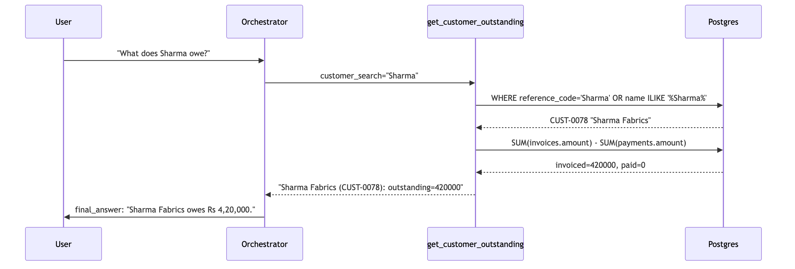
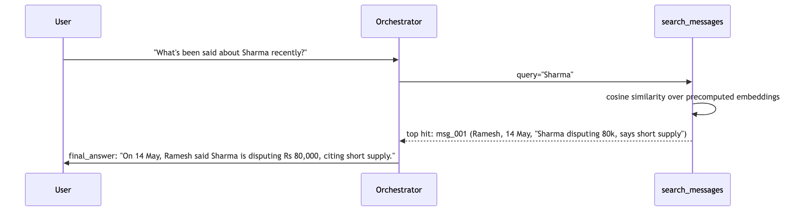
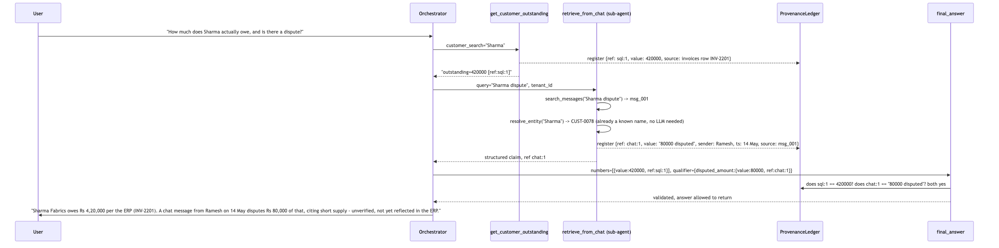

# Two Worlds Prototype

A system that reasons across two sources of truth for a business: a structured ERP (Postgres) and unstructured WhatsApp-style chat — answering questions that need both, while guaranteeing that every financial figure in an answer is traceable to a real database row, never invented by the model.

Full design and phased build plan: [PLAN.md](PLAN.md).

This document shows, with a concrete worked example, what the system does now that Phase 2 (SQL + chat search, built independently) and Phase 3 (entity linking, query planning, provenance/hard-line enforcement) are built — every example below is a real transcript against the seeded data, not a mockup.

## Seed data snapshot (tenant A)

**`suppliers`**
- `SUP-1043` — "Supplier B Ltd."
- `SUP-1099` — "Supplier C"

**`customers`**
- `CUST-0078` — "Sharma Fabrics"

**`purchase_orders`**
- `PO-4812` — supplier `SUP-1043`, status `open`, quantity `1000`, received `1000`, due `2024-05-21` (Tuesday)

**`invoices`**
- `INV-2201` — customer `CUST-0078`, amount `420000`

**`payments`** — none for `INV-2201`, so outstanding = `420000`

**`knowledge_base`**
- `"supp B"` → `SUP-1043`, source `reviewed`
- `"Supplier B"` → `SUP-1043`, source `reviewed`
- `"4812"` → `PO-4812`, source `reviewed`

**Chat messages (`chat_data/tenant_a_messages.json`)**
- `msg_001`, Ramesh, 14 May 09:02 — *"Sharma disputing 80k, says short supply"*
- `msg_002`, Priya, 17 May 11:30 — *"4812 partially received, 300 units short"*
- `msg_003`, Priya, 19 May 14:00 — *"supp B pushing delivery by a week"*

## Example 1 — simple SQL-only query (Level 1)

**User**: *"What does Sharma owe?"*

No chat involved at all — "Sharma" matches the ERP's own `name` column directly, so no alias lookup even runs.

## Example 2 — simple chat/message-only query (Level 1)

**User**: *"What's been said about Sharma recently?"*

No SQL involved at all — this never touches Postgres, purely the in-memory embedding search.

## Example 3 — combined query + message (Level 2: entity linking + hard line + provenance)

**User**: *"How much does Sharma actually owe, and is there a dispute?"*

This is where both worlds get fused — the orchestrator recognizes it needs a number (SQL) *and* dispute context (chat) about the same entity.

**What actually enforces correctness here**: `final_answer` never receives raw numbers — it receives `{value, ref}` pairs, and every ref gets checked against `ProvenanceLedger` before the answer is allowed to go out. If the model had typed a different disputed amount than what `msg_001` actually says, `final_answer` would reject it and force a retry — that's the hard line, enforced by architecture, not by prompting.

## Setup

See [PLAN.md](PLAN.md) section 11 for full setup instructions (Phase 1 is done and runnable today; Phase 2+3 setup steps apply once that build pass lands).
